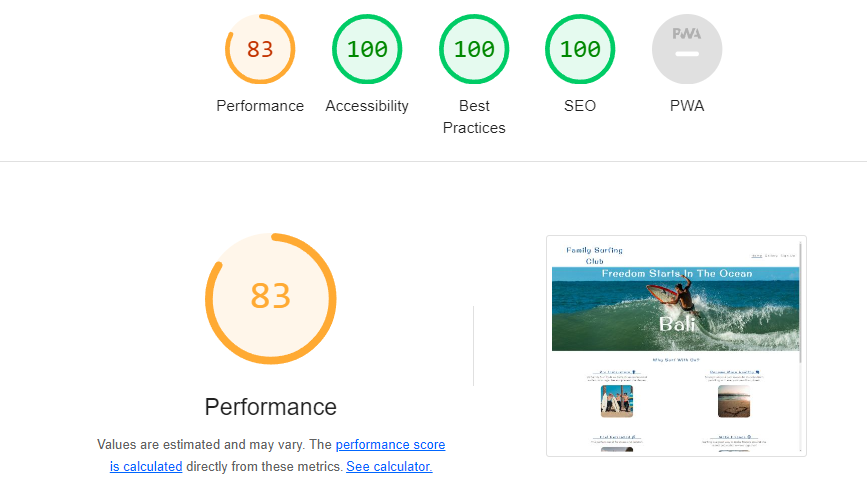

# Family Surfing Club

The Family Surfing Club is a landing page for families that are interested in learning to surf in Bali.
At the club we provide professional surfing guidance to children and parents with all safety precautions in place.

On this site users are able to see our class times,locations,pricing as well as receive a sign up form where the club will contact them back via email after registration. 
The website also host a gallery where users can see pictures of the surf classes.

## Features

### Header and Navigation

* Featured at the top of the page is the navigation bar where the logo is positioned in the left corner. The logo is a link to the home page and can be seen on all the pages.
* The navigation panel is to the top-right of the page. It includes access to home,gallery and sign up pages respectively and changes to a hamburger button on smaller devices.
* The navigation is kept in simple format to ensure user-friendly application and is easy to read to improve accessibility.
* The header is also a link to the home page and the nav bar indicates which page is active by underlining the active page.
* The custom font 'Original Surfer' was selected to create a fun-easy-going atmosphere and is well suited for the website.

### Hero Image

* The hero image is a surfer in the ocean with a text that explains to users that the ocean is where freedom begins.
* The location "Bali" is also indicated in the cover text so users can instantly know where these events take place. 

### Reasons to surf

* The website describes to the user why it is a good idea to join the club and all the benefits surfing provides.
* Each reason have a fitting image accompanied with it.

### Time and Place Bar

* The website contain a bar with all the relevant information i.e time, location, price and age group.

### Footer

* The footer contain links to the club's social media pages if users should want more information regarding the club.

### Gallery

* The club host a gallery on their page to share the surfing experience with the public.
* The pictures are neatly stacked together to save real estate on the page and to give the gallery a rich feeling.
  

### Sign Up Form

* The final page is a sign up page to new users.
* This form ask the user their age catogory as well as other personal information.
* The age catogory will be stored and users will be placed in different groups according to their age catogory.

 

## Testing

* I have tested that the page works in different browsers: Firefox, Chrome and Safari.
* All the navigation functions work and there are no broken links.
* The form requires the nessasary entries in every field and post the data to the right database.
* There is enough contrast in the project to ensure that the project is easy to read.

### HTML
* HTML - No errors returned when validated with W3C validator

### CSS
* CSS - No errors were returned when passing through the Jigsaw validator.

### Lighthouse in Devtools
* Lighthouse in DevTools was used to test different aspects of the website and the results were acceptable.

## Bugs

### Unfixed Bugs

* No unfixed bugs

### Bugs Fixed

* During development a mistake was made by editing the readme file in bithub. The problem was solved with the help of a tutor form Code Institute by merging the files from github and gitpod.

## Deployment

* The site was deployed to GitHub pages. The steps to deploy are as follows:

1. In Github repository, navigate to the settings tab.
2. Select the Master Branch from the source section drop-down menu
3. Once the master branch has been selected, the page provided the link to the completed website.

The live link can be found here - 

## Credits

### Content

* The base code to make the header, Form and the footer was taken from the CI Love Running Project and adjusted to fit this project.
* A big thanks to the team at https://learn.codeinstitute.net/ who gave professional advice on fixing bugs.

### Media
* All images were taken from https://www.Pexels.com with their original authors aas follows:

Photo by Kampus Production: https://www.pexels.com/photo/two-men-teaching-the-children-to-surf-6299932/

https://www.pexels.com/photo/man-riding-surfboard-on-body-of-water-1667005/

Photo by Ishan: https://www.pexels.com/photo/man-on-surfboard-surfing-on-wave-421788/

Photo by Emiliano Arano: https://www.pexels.com/photo/close-up-photo-of-water-1350197/

Photo by Kampus Production: https://www.pexels.com/photo/a-family-of-surfers-on-the-beach-6299920/

Photo by Jacub Gomez: https://www.pexels.com/photo/man-jumps-from-cliff-to-water-1168742/

