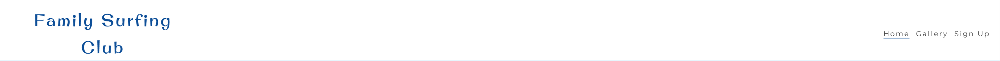

# Family Surfing Club

The Family Surfing Club is a landing page for families that are interested in learning to surf in Bali.
At the club we provide professional surfing guidance to children and parents with all safety precautions in place.

On this site users are able to see our class times,locations,pricing as well as receive a sign up form where the club will contact them back via email after registration. 
The website also host a gallery where users can see pictures of the surf classes.


## Features

### Header and Navigation

* Featured at the top of the page is the navigation bar where the logo is positioned in the left corner. The logo is a link to the home page and can be seen on all the pages.
* The navigation panel is to the top-right of the page. It includes access to home,gallery and sign up pages respectively and changes to a hamburger button on smaller devices.
* The navigation is kept in simple format to ensure user-friendly application and is easy to read to improve accessibility.
* The header is also a link to the home page and the nav bar indicates which page is active by underlining the active page.
* The custom font 'Original Surfer' was selected to create a fun-easy-going atmosphere and is well suited for the website.



### Hero Image

* The hero image is a surfer in the ocean with a text that explains to users that the ocean is where freedom begins.
* The location "Bali" is also indicated in the cover text so users can instantly know where these events take place. 


### Reasons to surf

* The website describes to the user why it is a good idea to join the club and all the benefits surfing provides.
* Each reason have a fitting image accompanied with it.


### Time and Place Bar

* The website contain a bar with all the relevant information i.e time, location, price and age group.


### Footer

* The footer contain links to the club's social media pages if users should want more information regarding the club.


### Gallery

* The club host a gallery on their page to share the surfing experience with the public.
* The pictures are neatly stacked together to save real estate on the page and to give the gallery a rich feeling.
  


### Sign Up Form

* The final page is a sign up page to new users.
* This form ask the user their age catogory as well as other personal information.
* The age catogory will be stored and users will be placed in different groups according to their age catogory.

  


### Installing

* How/where to download your program
* Any modifications needed to be made to files/folders

### Executing program

* How to run the program
* Step-by-step bullets
```
code blocks for commands
```

## Help

Any advise for common problems or issues.
```
command to run if program contains helper info
```

## Authors

Contributors names and contact info

ex. Dominique Pizzie  
ex. [@DomPizzie](https://twitter.com/dompizzie)

## Version History

* 0.2
    * Various bug fixes and optimizations
    * See [commit change]() or See [release history]()
* 0.1
    * Initial Release

## License

This project is licensed under the [NAME HERE] License - see the LICENSE.md file for details

## Acknowledgments

Inspiration, code snippets, etc.
* [awesome-readme](https://github.com/matiassingers/awesome-readme)
* [PurpleBooth](https://gist.github.com/PurpleBooth/109311bb0361f32d87a2)
* [dbader](https://github.com/dbader/readme-template)
* [zenorocha](https://gist.github.com/zenorocha/4526327)
* [fvcproductions](https://gist.github.com/fvcproductions/1bfc2d4aecb01a834b46)
