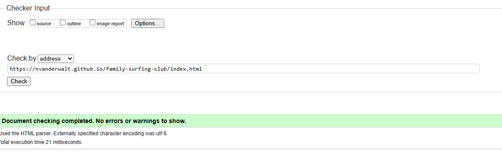

# Family Surfing Club

The Family Surfing Club is a landing page for families that are interested in learning to surf in Bali.
At the club we provide professional surfing guidance to children and parents with all safety precautions in place.

On this site users are able to see our class times,locations,pricing as well as receive a sign up form where the club will contact them back via email after registration. 
The website also host a gallery where users can see pictures of the surf classes.

## Features

### Header and Navigation

### Header and Navigation

- The **navigation bar** is located at the top of the page. The logo, positioned in the left corner, serves as a link to the home page and appears on all pages.
- On the top-right, you'll find links to the **Home**, **Gallery**, and **Sign-Up** pages. On smaller devices, the navigation changes to a **hamburger menu** for a more compact and user-friendly experience.
- The navigation is designed with simplicity and accessibility in mind, ensuring that users can easily navigate through the pages.
- The **header** also links to the home page. The active page is indicated by an underline beneath the corresponding navigation link.
- The custom font **"Original Surfer"** was selected to create a fun, easy-going atmosphere, which aligns well with the website’s surfing theme.

### Hero Image

- The **hero image** showcases a surfer in the ocean, with the text **"Where Freedom Begins"** displayed prominently.
- The image also indicates the location of the club, **Bali**, making it immediately clear where the surfing lessons take place.

### Reasons to Surf

- The website provides compelling reasons for families to join the club and emphasizes the many benefits of surfing.
- Each reason is paired with a relevant image to enhance user experience and provide visual context.

### Time and Place Bar

* The website contain a bar with all the relevant information i.e time, location, price and age group.

### Footer

* The footer contain links to the club's social media pages if users should want more information regarding the club.

### Gallery

* The club host a gallery on their page to share the surfing experience with the public.
* The pictures are neatly stacked together to save real estate on the page and to give the gallery a rich feeling.
  

### Sign Up Form

- The final page is a **sign-up page** for new users.
- This form asks for personal information, including the user's age category.
- Users will be placed into different groups based on their age category.

 

## Testing

* I have tested that the page works in different browsers: Firefox, Chrome and Safari.
* All the navigation functions work and there are no broken links.
* The form requires the nessasary entries in every field and post the data to the right database.
* There is enough contrast in the project to ensure that the project is easy to read.

### HTML
* HTML - No errors returned when validated with W3C validator

### CSS
* CSS - No errors were returned when passing through the Jigsaw validator.

### Lighthouse in Devtools
* Lighthouse in DevTools was used to test different aspects of the website and the results were acceptable.

## Bugs

### Unfixed Bugs

* No unfixed bugs

### Bugs Fixed

* During development a mistake was made by editing the readme file in bithub. The problem was solved with the help of a tutor form Code Institute by merging the files from github and gitpod.

## Deployment

The site was deployed to **GitHub Pages**. The steps to deploy are as follows:

1. Navigate to the settings tab of your GitHub repository.
2. Select the **Master Branch** from the source section drop-down menu.
3. Once the master branch is selected, GitHub will provide a link to the completed website.

You can access the live website here: https://nvanderwalt.github.io/family-surfing-club/

## Credits

### Content

* The base code to make the header, Form and the footer was taken from the CI Love Running Project and adjusted to fit this project.
* A big thanks to the team at https://learn.codeinstitute.net/ who gave professional advice on fixing bugs.

### Media
* All images were taken from https://www.Pexels.com with their original authors aas follows:

Photo by Kampus Production: https://www.pexels.com/photo/two-men-teaching-the-children-to-surf-6299932/

https://www.pexels.com/photo/man-riding-surfboard-on-body-of-water-1667005/

Photo by Ishan: https://www.pexels.com/photo/man-on-surfboard-surfing-on-wave-421788/

Photo by Emiliano Arano: https://www.pexels.com/photo/close-up-photo-of-water-1350197/

Photo by Kampus Production: https://www.pexels.com/photo/a-family-of-surfers-on-the-beach-6299920/

Photo by Jacub Gomez: https://www.pexels.com/photo/man-jumps-from-cliff-to-water-1168742/

